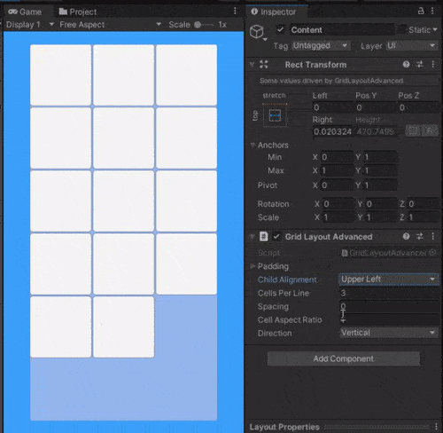

# Unity Grid Layout Advanced
Unity UI component that allows to placing by grid and resize childs with dynamic parent size.
## Preview

## About
Basic "Grid Layout" doesn't support dynamic screens/cell size native.
This component allow to place childs horizontalily/vertically with control childs's size by aspect ratio field.
## Abilities
- Vertical (Top-to bottom lines, left-to-right cells) or horizontal(left-to-right lines, top-to-bottom cells) placing directions
- Adaptive cells in line count (from 1 ofc)
- Manipulating last line cells alignment side. Controll by "Child alignment" property. In horizontal supports (Upper../Middle../Lower..), for vertical (..Left/ ..Center/ ..Right).
- Cells automatic resizes relative to CellsInLine and CellAspectRatio properties. Child's pivot doesn't matter. Inside cell you can do whatever what you want except sizeDelta and localPosition.
- Spacing between cells
- Padding supports
- "ContentSizeFitter" component doesn't required. Requires only RectTransform and some count of childs.

## Usage
Just download [this file](/Assets/Scripts/GridLayoutAdvanced.cs) and drop to your project. Then add "Layout/Grid Layout Advanced" component as new to parent of yours cells.

This component is developed for using in basic ScollView template (Hierarchy window > "+" > UI > ScrollView). In this case you need to add this component to "Content" object. Or just download whole project and open test scene where all prepared.

## Requirements
- This component is developed in 2020.3.37f1 LTS, but i think that it must work on Unity 2017 and younger.
- UnityUI package.
